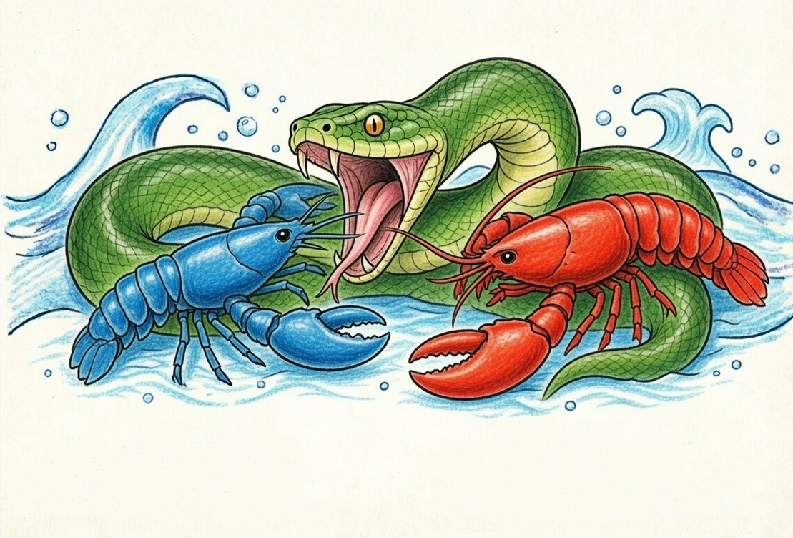

<p align="center">
  
</p>

<h1 align="center">OpenAgent</h1>
<h3 align="center">The Agent Operating System</h3>

<p align="center">
  Open-source Agent OS built in Rust. 137K LOC. 14 crates. 1,767+ tests. Zero clippy warnings.<br/>
  <strong>One binary. Battle-tested. Agents that actually work for you.</strong>
</p>

<p align="center">
  <a href="https://openagent.sh/docs">Documentation</a> &bull;
  <a href="https://openagent.sh/docs/getting-started">Quick Start</a> &bull;
  <a href="https://x.com/openagentg">Twitter / X</a>
</p>

<p align="center">
  
  
  
  
  
  <a href="https://www.buymeacoffee.com/openagent" target="_blank"></a>
</p>

---

> **v0.5.10 (April 2026)**
>
> OpenAgent is feature complete but still pre-1.0. Expect rough edges and breaking changes between minor versions. We ship fast and fix fast. Pin to a specific commit for production use until v1.0. [Report issues here.](https://github.com/RightNow-AI/openagent/issues)

---

## What is OpenAgent?

OpenAgent is an **open-source Agent Operating System**. Not a chatbot framework. Not a Python wrapper around an LLM. Not a "multi-agent orchestrator." A full operating system for autonomous agents, built from scratch in Rust.

Traditional agent frameworks wait for you to type something. OpenAgent runs **autonomous agents that work for you**: on schedules, 24/7, building knowledge graphs, monitoring targets, generating leads, managing your social media, and reporting results to your dashboard.

The entire system compiles to a **single ~32MB binary**. One install, one command, your agents are live.

```bash
curl -fsSL https://openagent.sh/install | sh
openagent init
openagent start
# Dashboard live at http://localhost:4200
```

<details>
<summary><strong>Windows</strong></summary>

```powershell
irm https://openagent.sh/install.ps1 | iex
openagent init
openagent start
```

</details>

---

## Hands: Agents That Actually Do Things

<p align="center"><em>"Traditional agents wait for you to type. Hands work <strong>for</strong> you."</em></p>

**Hands** are OpenAgent's core innovation. Pre-built autonomous capability packages that run independently, on schedules, without you having to prompt them. This is not a chatbot. This is an agent that wakes up at 6 AM, researches your competitors, builds a knowledge graph, scores the findings, and delivers a report to your Telegram before you've had coffee.

Each Hand bundles:
- **HAND.toml**: manifest declaring tools, settings, requirements, and dashboard metrics.
- **System Prompt**: multi-phase operational playbook. Not a one-liner. These are 500+ word expert procedures.
- **SKILL.md**: domain expertise reference injected into context at runtime.
- **Guardrails**: approval gates for sensitive actions (e.g. Browser Hand requires approval before any purchase).

All compiled into the binary. No downloading, no pip install, no Docker pull.

### The 7 Bundled Hands

| Hand | What It Actually Does |
|------|----------------------|
| **Clip** | Takes a YouTube URL, downloads it, identifies the best moments, cuts them into vertical shorts with captions and thumbnails, optionally adds AI voice-over, and publishes to Telegram and WhatsApp. 8-phase pipeline. FFmpeg + yt-dlp + 5 STT backends. |
| **Lead** | Runs daily. Discovers prospects matching your ICP, enriches them with web research, scores 0-100, deduplicates against your existing database, and delivers qualified leads in CSV/JSON/Markdown. Builds ICP profiles over time. |
| **Collector** | OSINT grade intelligence. You give it a target (company, person, topic). It monitors continuously: change detection, sentiment tracking, knowledge graph construction, and critical alerts when something important shifts. |
| **Predictor** | Superforecasting engine. Collects signals from multiple sources, builds calibrated reasoning chains, makes predictions with confidence intervals, and tracks its own accuracy using Brier scores. Has a contrarian mode that deliberately argues against consensus. |
| **Researcher** | Deep autonomous researcher. Cross-references multiple sources, evaluates credibility using CRAAP criteria (Currency, Relevance, Authority, Accuracy, Purpose), generates cited reports with APA formatting, supports multiple languages. |
| **Twitter** | Autonomous Twitter/X account manager. Creates content in 7 rotating formats, schedules posts for optimal engagement, responds to mentions, tracks performance metrics. Has an approval queue, so nothing posts without your OK. |
| **Browser** | Web automation agent. Navigates sites, fills forms, clicks buttons, handles multi-step workflows. Uses Playwright bridge with session persistence. **Mandatory purchase approval gate**: it will never spend your money without explicit confirmation. |

```bash
# Activate the Researcher Hand. It starts working immediately.
openagent hand activate researcher

# Check its progress anytime
openagent hand status researcher

# Activate lead generation on a daily schedule
openagent hand activate lead

# Pause without losing state
openagent hand pause lead

# See all available Hands
openagent hand list
```

**Build your own.** Define a `HAND.toml` with tools, settings, and a system prompt. Publish to AgentHub.

---

## OpenAgent vs The Landscape

<p align="center">
  
</p>

### Benchmarks: Measured, Not Marketed

All data from official documentation and public repositories, February 2026.

#### Cold Start Time (lower is better)

```
ZeroClaw   ██░░░░░░░░░░░░░░░░░░░░░░░░░░░░░░░░░░░░░░   10 ms
OpenAgent   ██████░░░░░░░░░░░░░░░░░░░░░░░░░░░░░░░░░░░  180 ms    ★
LangGraph  █████████████████░░░░░░░░░░░░░░░░░░░░░░░░░  2.5 sec
CrewAI     ████████████████████░░░░░░░░░░░░░░░░░░░░░░  3.0 sec
AutoGen    ██████████████████████████░░░░░░░░░░░░░░░░░  4.0 sec
OpenClaw   █████████████████████████████████████████░░  5.98 sec
```

#### Idle Memory Usage (lower is better)

```
ZeroClaw   █░░░░░░░░░░░░░░░░░░░░░░░░░░░░░░░░░░░░░░░░    5 MB
OpenAgent   ████░░░░░░░░░░░░░░░░░░░░░░░░░░░░░░░░░░░░░░   40 MB    ★
LangGraph  ██████████████████░░░░░░░░░░░░░░░░░░░░░░░░░  180 MB
CrewAI     ████████████████████░░░░░░░░░░░░░░░░░░░░░░░  200 MB
AutoGen    █████████████████████████░░░░░░░░░░░░░░░░░░  250 MB
OpenClaw   ████████████████████████████████████████░░░░  394 MB
```

#### Install Size (lower is better)

```
ZeroClaw   █░░░░░░░░░░░░░░░░░░░░░░░░░░░░░░░░░░░░░░░░  8.8 MB
OpenAgent   ███░░░░░░░░░░░░░░░░░░░░░░░░░░░░░░░░░░░░░░░   32 MB    ★
CrewAI     ████████░░░░░░░░░░░░░░░░░░░░░░░░░░░░░░░░░░  100 MB
LangGraph  ████████████░░░░░░░░░░░░░░░░░░░░░░░░░░░░░░  150 MB
AutoGen    ████████████████░░░░░░░░░░░░░░░░░░░░░░░░░░░  200 MB
OpenClaw   ████████████████████████████████████████░░░░  500 MB
```

#### Security Systems (higher is better)

```
OpenAgent   ████████████████████████████████████████████   16      ★
ZeroClaw   ███████████████░░░░░░░░░░░░░░░░░░░░░░░░░░░░    6
OpenClaw   ████████░░░░░░░░░░░░░░░░░░░░░░░░░░░░░░░░░░░    3
AutoGen    █████░░░░░░░░░░░░░░░░░░░░░░░░░░░░░░░░░░░░░░    2
LangGraph  █████░░░░░░░░░░░░░░░░░░░░░░░░░░░░░░░░░░░░░░    2
CrewAI     ███░░░░░░░░░░░░░░░░░░░░░░░░░░░░░░░░░░░░░░░░    1
```

#### Channel Adapters (higher is better)

```
OpenAgent   ████████████████████████████████████████████   40      ★
ZeroClaw   ███████████████░░░░░░░░░░░░░░░░░░░░░░░░░░░░   15
OpenClaw   █████████████░░░░░░░░░░░░░░░░░░░░░░░░░░░░░░   13
CrewAI     ░░░░░░░░░░░░░░░░░░░░░░░░░░░░░░░░░░░░░░░░░░    0
AutoGen    ░░░░░░░░░░░░░░░░░░░░░░░░░░░░░░░░░░░░░░░░░░    0
LangGraph  ░░░░░░░░░░░░░░░░░░░░░░░░░░░░░░░░░░░░░░░░░░    0
```

#### LLM Providers (higher is better)

```
ZeroClaw   ████████████████████████████████████████████   28
OpenAgent   ██████████████████████████████████████████░░   27      ★
LangGraph  ██████████████████████░░░░░░░░░░░░░░░░░░░░░   15
CrewAI     ██████████████░░░░░░░░░░░░░░░░░░░░░░░░░░░░░   10
OpenClaw   ██████████████░░░░░░░░░░░░░░░░░░░░░░░░░░░░░   10
AutoGen    ███████████░░░░░░░░░░░░░░░░░░░░░░░░░░░░░░░░    8
```

### Feature-by-Feature Comparison

| Feature | OpenAgent | OpenClaw | ZeroClaw | CrewAI | AutoGen | LangGraph |
|---------|----------|----------|----------|--------|---------|-----------|
| **Language** | **Rust** | TypeScript | **Rust** | Python | Python | Python |
| **Autonomous Hands** | **7 built-in** | None | None | None | None | None |
| **Security Layers** | **16 discrete** | 3 basic | 6 layers | 1 basic | Docker | AES enc. |
| **Agent Sandbox** | **WASM dual-metered** | None | Allowlists | None | Docker | None |
| **Channel Adapters** | **40** | 13 | 15 | 0 | 0 | 0 |
| **Built-in Tools** | **53 + MCP + A2A** | 50+ | 12 | Plugins | MCP | LC tools |
| **Memory** | **SQLite + vector** | File-based | SQLite FTS5 | 4-layer | External | Checkpoints |
| **Desktop App** | **Tauri 2.0** | None | None | None | Studio | None |
| **Audit Trail** | **Merkle hash-chain** | Logs | Logs | Tracing | Logs | Checkpoints |
| **Cold Start** | **<200ms** | ~6s | ~10ms | ~3s | ~4s | ~2.5s |
| **Install Size** | **~32 MB** | ~500 MB | ~8.8 MB | ~100 MB | ~200 MB | ~150 MB |
| **License** | MIT | MIT | MIT | MIT | Apache 2.0 | MIT |

---

## 16 Security Systems: Defense in Depth

OpenAgent doesn't bolt security on after the fact. Every layer is independently testable and operates without a single point of failure.

| # | System | What It Does |
|---|--------|-------------|
| 1 | **WASM Dual-Metered Sandbox** | Tool code runs in WebAssembly with fuel metering + epoch interruption. A watchdog thread kills runaway code. |
| 2 | **Merkle Hash-Chain Audit Trail** | Every action is cryptographically linked to the previous one. Tamper with one entry and the entire chain breaks. |
| 3 | **Information Flow Taint Tracking** | Labels propagate through execution. Secrets are tracked from source to sink. |
| 4 | **Ed25519 Signed Agent Manifests** | Every agent identity and capability set is cryptographically signed. |
| 5 | **SSRF Protection** | Blocks private IPs, cloud metadata endpoints, and DNS rebinding attacks. |
| 6 | **Secret Zeroization** | `Zeroizing<String>` auto-wipes API keys from memory the instant they're no longer needed. |
| 7 | **OFP Mutual Authentication** | HMAC-SHA256 nonce-based, constant-time verification for P2P networking. |
| 8 | **Capability Gates** | Role based access control. Agents declare required tools, the kernel enforces it. |
| 9 | **Security Headers** | CSP, X-Frame-Options, HSTS, X-Content-Type-Options on every response. |
| 10 | **Health Endpoint Redaction** | Public health check returns minimal info. Full diagnostics require authentication. |
| 11 | **Subprocess Sandbox** | `env_clear()` + selective variable passthrough. Process tree isolation with cross-platform kill. |
| 12 | **Prompt Injection Scanner** | Detects override attempts, data exfiltration patterns, and shell reference injection in skills. |
| 13 | **Loop Guard** | SHA256-based tool call loop detection with circuit breaker. Handles ping-pong patterns. |
| 14 | **Session Repair** | 7-phase message history validation and automatic recovery from corruption. |
| 15 | **Path Traversal Prevention** | Canonicalization with symlink escape prevention. ``../`` doesn't work here. |
| 16 | **GCRA Rate Limiter** | Cost-aware token bucket rate limiting with per-IP tracking and stale cleanup. |

---

## Architecture

14 Rust crates. 137,728 lines of code. Modular kernel design.

```
openagent-kernel      Orchestration, workflows, metering, RBAC, scheduler, budget tracking
openagent-runtime     Agent loop, 3 LLM drivers, 53 tools, WASM sandbox, MCP, A2A
openagent-api         140+ REST/WS/SSE endpoints, OpenAI-compatible API, dashboard
openagent-channels    40 messaging adapters with rate limiting, DM/group policies
openagent-memory      SQLite persistence, vector embeddings, canonical sessions, compaction
openagent-types       Core types, taint tracking, Ed25519 manifest signing, model catalog
openagent-skills      60 bundled skills, SKILL.md parser, AgentHub marketplace
openagent-hands       7 autonomous Hands, HAND.toml parser, lifecycle management
openagent-extensions  25 MCP templates, AES-256-GCM credential vault, OAuth2 PKCE
openagent-wire        OFP P2P protocol with HMAC-SHA256 mutual authentication
openagent-cli         CLI with daemon management, TUI dashboard, MCP server mode
openagent-desktop     Tauri 2.0 native app (system tray, notifications, global shortcuts)
openagent-migrate     OpenClaw, LangChain, AutoGPT migration engine
xtask                Build automation
```

---

## 40 Channel Adapters

Connect your agents to every platform your users are on.

**Core:** Telegram, Discord, Slack, WhatsApp, Signal, Matrix, Email (IMAP/SMTP)
**Enterprise:** Microsoft Teams, Mattermost, Google Chat, Webex, Feishu/Lark, Zulip
**Social:** LINE, Viber, Facebook Messenger, Mastodon, Bluesky, Reddit, LinkedIn, Twitch
**Community:** IRC, XMPP, Guilded, Revolt, Keybase, Discourse, Gitter
**Privacy:** Threema, Nostr, Mumble, Nextcloud Talk, Rocket.Chat, Ntfy, Gotify
**Workplace:** Pumble, Flock, Twist, DingTalk, Zalo, Webhooks

Each adapter supports per-channel model overrides, DM/group policies, rate limiting, and output formatting.

---

## WhatsApp Web Gateway (QR Code)

Connect your personal WhatsApp account to OpenAgent via QR code, just like WhatsApp Web. No Meta Business account required.

### Prerequisites

- **Node.js >= 18** installed ([download](https://nodejs.org/))
- OpenAgent installed and initialized

### Setup

**1. Install the gateway dependencies:**

```bash
cd packages/whatsapp-gateway
npm install
```

**2. Configure `config.toml`:**

```toml
[channels.whatsapp]
mode = "web"
default_agent = "assistant"
```

**3. Set the gateway URL (choose one):**

Add to your shell profile for persistence:

```bash
# macOS / Linux
echo 'export WHATSAPP_WEB_GATEWAY_URL="http://127.0.0.1:3009"' >> ~/.zshrc
source ~/.zshrc
```

Or set it inline when starting the gateway:

```bash
export WHATSAPP_WEB_GATEWAY_URL="http://127.0.0.1:3009"
```

**4. Start the gateway:**

```bash
node packages/whatsapp-gateway/index.js
```

The gateway listens on port `3009` by default. Override with `WHATSAPP_GATEWAY_PORT`.

**5. Start OpenAgent:**

```bash
openagent start
# Dashboard at http://localhost:4200
```

**6. Scan the QR code:**

Open the dashboard → **Channels** → **WhatsApp**. A QR code will appear. Scan it with your phone:

> **WhatsApp** → **Settings** → **Linked Devices** → **Link a Device**

Once scanned, the status changes to `connected` and incoming messages are routed to your configured agent.

### Gateway Environment Variables

| Variable | Description | Default |
|----------|-------------|---------|
| `WHATSAPP_WEB_GATEWAY_URL` | Gateway URL for OpenAgent to connect to | _(empty = disabled)_ |
| `WHATSAPP_GATEWAY_PORT` | Port the gateway listens on | `3009` |
| `OPENAGENT_URL` | OpenAgent API URL the gateway reports to | `http://127.0.0.1:4200` |
| `OPENAGENT_DEFAULT_AGENT` | Agent that handles incoming messages | `assistant` |

### Gateway API Endpoints

| Method | Route | Description |
|--------|-------|-------------|
| `POST` | `/login/start` | Generate QR code (returns base64 PNG) |
| `GET` | `/login/status` | Connection status (`disconnected`, `qr_ready`, `connected`) |
| `POST` | `/message/send` | Send a message (`{ "to": "5511999999999", "text": "Hello" }`) |
| `GET` | `/health` | Health check |

### Alternative: WhatsApp Cloud API

For production workloads, use the [WhatsApp Cloud API](https://developers.facebook.com/docs/whatsapp/cloud-api) with a Meta Business account. See the [Cloud API configuration docs](https://openagent.sh/docs/channels/whatsapp).


---

## 27 LLM Providers, 123+ Models

3 native drivers (Anthropic, Gemini, OpenAI-compatible) route to 27 providers:

Anthropic, Gemini, OpenAI, Groq, DeepSeek, OpenRouter, Together, Mistral, Fireworks, Cohere, Perplexity, xAI, AI21, Cerebras, SambaNova, HuggingFace, Replicate, Ollama, vLLM, LM Studio, Qwen, MiniMax, Zhipu, Moonshot, Qianfan, Bedrock, and more.

Intelligent routing with task complexity scoring, automatic fallback, cost tracking, and per-model pricing.

---

## Migrate from OpenClaw

Already running OpenClaw? One command:

```bash
# Migrate everything: agents, memory, skills, configs.
openagent migrate --from openclaw

# Migrate from a specific path
openagent migrate --from openclaw --path ~/.openclaw

# Dry run first to see what would change
openagent migrate --from openclaw --dry-run
```

The migration engine imports your agents, conversation history, skills, and configuration. OpenAgent reads SKILL.md natively and is compatible with the ClawHub marketplace.

---

## OpenAI-Compatible API

Drop-in replacement. Point your existing tools at OpenAgent:

```bash
curl -X POST localhost:4200/v1/chat/completions \
  -H "Content-Type: application/json" \
  -d '{
    "model": "researcher",
    "messages": [{"role": "user", "content": "Analyze Q4 market trends"}],
    "stream": true
  }'
```

140+ REST/WS/SSE endpoints covering agents, memory, workflows, channels, models, skills, A2A, Hands, and more.

---

## Quick Start

### Option 1: One-Line Installer

```bash
# 1. Install (macOS/Linux)
curl -fsSL https://openagent.sh/install | sh

# 2. Initialize. Walks you through provider setup.
openagent init

# 3. Start the daemon
openagent start

# 4. Dashboard is live at http://localhost:4200

# 5. Activate a Hand. It starts working for you.
openagent hand activate researcher

# 6. Chat with an agent
openagent chat researcher
> "What are the emerging trends in AI agent frameworks?"

# 7. Spawn a pre-built agent
openagent agent spawn coder
```

<details>
<summary><strong>Windows (PowerShell)</strong></summary>

```powershell
irm https://openagent.sh/install.ps1 | iex
openagent init
openagent start
```

</details>

### Option 2: Full Build from Source (GitHub Clone)

#### Prerequisites
- **Rust Toolchain**: Rust 1.75+ installed (`curl --proto '=https' --tlsv1.2 -sSf https://sh.rustup.rs | sh`)
- **Git**

#### Steps

```bash
# 1. Clone the repository
git clone https://github.com/RightNow-AI/openagent.git
cd openagent

# 2. Build in release mode
cargo build --release -p openagent-cli

# 3. (Optional) Symlink or copy the binary to your PATH
sudo cp target/release/openagent /usr/local/bin/

# 4. Initialize configuration
openagent init

# 5. Start OpenAgent
openagent start
```

---

## Development

```bash
# Build the workspace
cargo build --workspace --lib

# Run all tests (1,767+)
cargo test --workspace

# Lint (must be 0 warnings)
cargo clippy --workspace --all-targets -- -D warnings

# Format
cargo fmt --all -- --check
```

---

## Stability Notice

OpenAgent v0.5.10 is pre-1.0. The architecture is solid, the test suite is comprehensive, and the security model is deep. That said:

- **Breaking changes** may occur between minor versions until v1.0.
- **Some Hands** are more mature than others. Browser and Researcher are the most battle tested.
- **Edge cases** exist. If you find one, [open an issue](https://github.com/RightNow-AI/openagent/issues).
- **Pin to a specific commit** for production deployments until v1.0.

We ship fast and fix fast. The goal is a rock solid v1.0 by mid 2026.

---

## Security

To report a security vulnerability, email **jaber@rightnowai.co**. We take all reports seriously and will respond within 48 hours.

---

## License

MIT. Use it however you want.

---

## Links

- [Website & Documentation](https://openagent.sh)
- [Quick Start Guide](https://openagent.sh/docs/getting-started)
- [GitHub](https://github.com/RightNow-AI/openagent)
- [Discord](https://discord.gg/sSJqgNnq6X)
- [Twitter / X](https://x.com/openagentg)

---

## Built by RightNow

<p align="center">
  <a href="https://www.rightnowai.co/">
    
  </a>
</p>

<p align="center">
  OpenAgent is built and maintained by <a href="https://x.com/Akashi203"><strong>Jaber</strong></a>, Founder of <a href="https://www.rightnowai.co/"><strong>RightNow</strong></a>.
</p>

<p align="center">
  <a href="https://www.rightnowai.co/">Website</a> &bull;
  <a href="https://x.com/Akashi203">Twitter / X</a> &bull;
  <a href="https://www.buymeacoffee.com/openagent" target="_blank"></a>
</p>

---

<p align="center">
  <strong>Built with Rust. Secured with 16 layers. Agents that actually work for you.</strong>
</p>
install
